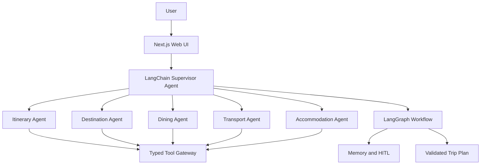

# AI Trip Planner

AI Trip Planner is a single-user, multi-agent travel workspace. A user describes a trip, the
supervisor delegates research to specialist agents, and the system returns a grounded itinerary
with budget, transport, accommodation, dining and destination guidance.

The project is being migrated from a custom `Agent.run()` abstraction to LangChain JS
`createAgent()` specialists coordinated by a LangGraph workflow.

Live demo: [whw0591-ai-trip-planner.vercel.app](https://whw0591-ai-trip-planner.vercel.app)

## Current status

The LangChain agent migration has landed on `main`.

- Every specialist is a named LangChain JS agent with typed evidence or calculator tools and a Zod
  structured response; LangGraph still owns durable state, conflict checks, retries and HITL.
- Revision requests are immutable inputs to targeted tools chosen by a dedicated revision
  supervisor.
- Memory, HITL, conflict validation, UI and proposal contracts were preserved across the migration;
  the legacy `Agent.run()` / `revise()` compatibility type is gone.

See [the architecture and migration plan](docs/agent-architecture.md) for details.

## Prerequisites

- Node.js 22 LTS or newer
- Corepack-enabled pnpm
- API keys are optional for local development; deterministic fallbacks and mock tools are enabled
  by default.

## Architecture



The target architecture uses LangGraph for durable state, validation, conflict checks, retries,
HITL and plan persistence, with LangChain agents responsible for role-specific reasoning and tool
selection. The target is implemented on the refactor branch; `main` remains on the compatibility
path until that work is merged.

## Quick start

```bash
corepack enable
pnpm install
pnpm dev                         # http://localhost:3000
pnpm typecheck
pnpm test
pnpm build
```

Copy `.env.example` to `.env.local`. `USE_MOCK_TOOLS=true` uses local map and booking fixtures;
set it to `false` to use the OpenStreetMap adapters. GPT handles chat extraction, DeepSeek handles
itinerary generation, and provider failures fall back to validated deterministic output.
Docker setup is documented in [docs/development.md](docs/development.md).

## API entry points

The web server exposes the core workflow through:

- `POST /api/chat` — extract trip updates, run planning and return the current plan.

The HITL and saved-trip routes from the Stage 5.3 prototype will be reconnected after the Agent
migration. See [docs/api.md](docs/api.md) for the current route and migration notes.

## Repository layout

```text
apps/web/                 Next.js UI and API routes
packages/agents/          Specialist LangChain agents and fallbacks
packages/orchestrator/    Supervisor integration and LangGraph workflow
packages/shared/          Zod contracts, plans and ports
packages/services/        Memory and service adapters
packages/tools/           Maps, booking and external tool gateways
docs/                     Architecture, workflow, roadmap and session notes
```

## Documentation

- [Agent architecture and migration](docs/agent-architecture.md)
- [Development environment](docs/development.md)
- [Team and Git workflow](docs/team-workflow.md)
- [Product roadmap](docs/roadmap.md)
- [API entry points](docs/api.md)
- [Scaffold and module ownership](docs/scaffold.md)
- [UML and design model](docs/class-diagram.md), including the [diagram index](docs/diagrams/)
- [Session-log template](docs/session-logs/TEMPLATE.md)

## Scope

The current product target is a single-user flow: enter a trip, inspect grounded recommendations,
edit the plan, confirm HITL decisions, save it, and use it while travelling. Multi-user editing,
social features, payments and booking fulfilment are out of scope for the current roadmap.
